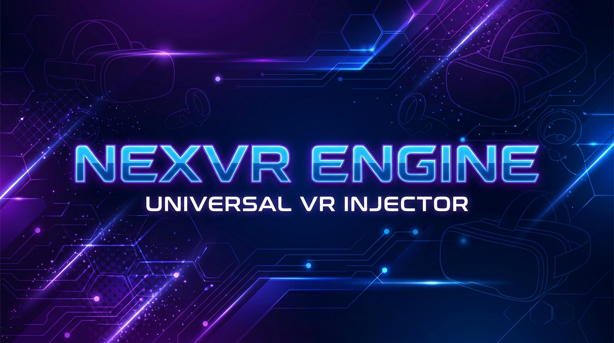

 

# NEXVR ENGINE

### 🎮 Play Any PC Game in Virtual Reality

**NexVR Engine is a universal VR injector that transforms any DirectX 11, DirectX 12, or Vulkan game into an immersive stereoscopic 3D VR experience — no game modification required.**

[📥 Download Latest Release](https://github.com/sathishssj3/NexVR-Engine-Releases/releases/latest) · [🐛 Report Bug](https://github.com/sathishssj3/NexVR-Engine-Releases/issues) · [💡 Request Feature](https://github.com/sathishssj3/NexVR-Engine-Releases/issues)

---

## ✨ Features

| Feature | Description |
|---------|-------------|
| 🎯 **Universal Injection** | Works with DirectX 11, DirectX 12, and Vulkan games automatically |
| 🧠 **AI-Powered Depth** | ONNX Runtime + DirectML neural depth estimation for stereoscopic 3D |
| 🔧 **Zero Configuration** | Automatically detects your game's graphics API and applies optimal settings |
| 📋 **Game Profiles** | Pre-tuned profiles for popular titles (Hogwarts Legacy, Cyberpunk 2077, Elden Ring, and more) |
| ⚡ **Real-Time Performance** | Engineered for 90 FPS VR with < 11.1ms frame budget |
| 🔄 **Auto Updates** | Silent OTA hot-patching — bug fixes arrive in seconds, no reinstall needed |
| 🖥️ **Modern Launcher** | Beautiful Electron-based command center with one-click injection |

## 🎮 Verified Games

| Game | Graphics API | Status |
|------|-------------|--------|
| Hogwarts Legacy | DX12 | ✅ Verified |
| Sekiro: Shadows Die Twice | DX11 | ✅ Verified |
| Mortal Shell | DX11 | ✅ Verified |
| No Man's Sky | Vulkan | ✅ Verified |

> 💡 **Any DirectX 11/12 or Vulkan game should work!** The games above are titles we've specifically tested and verified. More coming soon!

## 🚀 Quick Start

### 1. Download & Install
Click the button below to download the latest installer:

Run `NexVR Engine Setup 0.1.0.exe` and follow the installation wizard.

### 2. Launch & Select Your Game
Open **NexVR Engine** from your Start Menu or Desktop shortcut. Browse or search for your game.

### 3. Click INJECT
Hit the **INJECT** button and put on your VR headset. Your game is now in VR! 🎉

## 💻 System Requirements

| Component | Minimum | Recommended |
|-----------|---------|-------------|
| **OS** | Windows 10 (64-bit) | Windows 11 (64-bit) |
| **GPU** | GTX 1060 / RX 580 | RTX 3070 / RX 6800 XT |
| **VRAM** | 4 GB | 8 GB+ |
| **RAM** | 8 GB | 16 GB+ |
| **VR Headset** | Any SteamVR / OpenXR compatible | Quest 3 / Valve Index / Pimax |
| **Runtime** | SteamVR or OpenXR | SteamVR + OpenXR |

## 🛡️ Antivirus Notice

> ⚠️ **NexVR Engine uses DLL injection to add VR rendering to games.** Some antivirus software may flag this as suspicious — this is a **false positive**. The injection technique is the same used by legitimate overlays (Steam, Discord, NVIDIA GeForce Experience). You may need to add NexVR to your antivirus exclusion list.

## 🤝 Anti-Cheat Policy

NexVR Engine is designed for **single-player and cooperative games only**.

- ❌ **Do NOT use** with games running active anti-cheat (EAC, BattlEye, Vanguard)
- ✅ **Safe to use** with single-player games and offline modes
- ⚠️ Games with anti-cheat are automatically detected and blocked by NexVR

## 📬 Feedback & Issues

Found a bug? Have a suggestion? We'd love to hear from you!

- 🐛 [Open an Issue](https://github.com/sathishssj3/NexVR-Engine-Releases/issues/new?template=bug_report.md)
- 💡 [Request a Feature](https://github.com/sathishssj3/NexVR-Engine-Releases/issues/new?template=feature_request.md)
- 💬 [Start a Discussion](https://github.com/sathishssj3/NexVR-Engine-Releases/discussions)

## 📄 License

NexVR Engine is proprietary software. All rights reserved.  
© 2026 Sathish SSJ3. Unauthorized distribution or reverse engineering is prohibited.

---

**Made with ❤️ by [Sathish SSJ3](https://github.com/sathishssj3)**

NexVR Engine is not affiliated with any game studio or VR hardware manufacturer.

